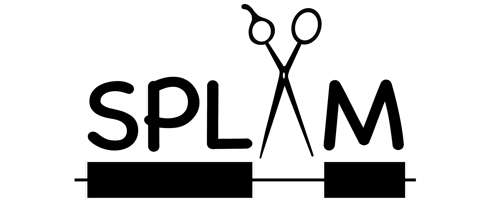

<!-- <h1 align="center">splam</h1> --> 
 


splam model is a splice junction recognition model based on a deep residual convolutional neural network. It was trained on donor and acceptor pairs combined and focuses on a narrow window of 400 basepairs surrounding each splice site, inspired by the understanding that the splicing process primarily depends on signals within this specific region.

There are two main use case scenarios:

1. Evaluating all splice sites in an annotation file or assembled transcripts.
2. Evaluating all splice junctions in an alignment file and remove spliced alignment containing spurious splice sites. 


<!-- # Table of Contents
- [Table of Contents](#table-of-contents)
- [User's Guide](#users-guide)
  - [Installation](#installation)
- [Model Architecture](#model-architecture) -->

# <a name="getting_started"></a>Getting started

## <a name="installation"></a>Installation

You can install splam with conda package manager. This is the easiest approach.
```
TBC
```

You can also install splam from source
```
git clone https://github.com/Kuanhao-Chao/splam --recursive
cd splam/src/
python setup.py install
```

or with pip
```
pip install splam
```


## <a name="usage"></a>Usage

### <a name="annotation_splam"></a>Evaluating splice junctions in an annotation file.

The first use case scenario is to evaluate all splice junctions in an annotation file or transcripts assembled by assemblers for instance StringTie, scallop, etc. Acceptable file formats are `GFF` and `GTF`. Users run this mode with two steps, `extract` and `score`.

#### <a name="annotation_splam_extract"></a> Extracting splice junctions
In this example, given a `GFF` file, you first run 

```
splam extract input.gff
```

splam iterates through the gff file, extracts all introns in transcripts, and writes their coordinates into a `BED` file, with six columns, `CHROM`, `START`, `END`, `JUNC_NAME`, `INTRON_NUM`, and `STRAND`. Following is a few entries of the BED file.

```
chr9    14940   15080   JUNC00000001    251     -
chr9    14940   15040   JUNC00000002    4       -
chr9    14954   15080   JUNC00000003    3       -
```


### <a name="annotation_splam_score"></a>Scoring splice junctions
The next step is to score all the extracted splice junctions. For this step, you need the BED file generated from the previous step, and two additional files which are (1) the reference genome which its coordinates the junction BED file shared with and (2) splam model which you can find in `model/splam_script.pt`. After you have all these files, you can run the following command to score all splice junctions:

```
splam score -G chr9.fa -m ../model/splam_script.pt -o tmp_splam_out tmp_splam_out/junction.bed
```

This step outputs a new BED file with eigth columns. Two new appended columns are `DONOR_SCORE` and `ACCEPTOR_SCORE`. Note that any unstranded introns are excluded (p.s. they might be from unstranded transcripts assembled by StringTie).

```
chr9    14940   15080   JUNC_0  1       -       0.9999496       0.99997985
chr9    14940   15040   JUNC_1  1       -       0.9967939       0.9991217
chr9    14954   15080   JUNC_2  1       -       0.9030796       0.9573919
chr9    15347   16025   JUNC_4  1       -       5.2404507e-09   1.0171946e-08
```


## <a name="usage"></a>splam usage

There are three mode of splam, which are `extract`, `score`, and `clean`. 

```
usage: splam [-h] [-v] [-c] {extract,score,clean} ...

splice junction predictor to improve alignment files (BAM / CRAM)

optional arguments:
  -h, --help            show this help message and exit
  -v, --version
  -c, --citation

Commands:
  {extract,score,clean}
    extract             Extracting all splice junctions from a BAM file
    score               Scoring all splice junctions
    clean               Cleaning up spurious splice alignment
```


## <a name="junction_extract"></a>Extracting splice junctions

In this step, you input a sorted BAM file. SPLAM extracts all splice junctions from the alignments and writes out a BED file with the coordinates of every junction. You can run it with or without alignment pairing by setting the argument '-P'. The latter option unpairs the alignment's mate if it gets removed.

If you simply want to extract splice junctions in the BAM file without running the following steps, you can run with the `--write-junctions-only` argument to skip writing out temporary files.

```
usage: splam extract [-h] [-V] [-P] [-n] [-o DIR] [-M DIST] [-g GAP] BAM_INPUT

positional arguments:
  BAM_INPUT             target alignment file in BAM format.

optional arguments:
  -h, --help            show this help message and exit
  -V, --verbose         running splam in verbose mode
  -P, --paired          paired-end bundling alignments
  -n, --write-junctions-only
                        only write out splice junction bed file without other temporary files.
  -o DIR, --outdir DIR  the directory where the output file is written to. Default output filename is "junction_score.bed"
  -M DIST, --max-splice DIST
                        maximum splice junction length
  -g GAP, --bundle-gap GAP
                        minimum gap between bundles
```

## <a name="score_splam"></a>Scoring splice junctions 

After extracting splice junctions, you can run splam with the `score` mode to score each splice junction in the BED file generated from the previous step. Stranded splice junctions will be scored using splam's deep convolutional neural network in batches, and the result of this process will be a new BED file containing the donor and acceptor scores.

```
usage: splam score [-h] [-V] [-o DIR] -G REF.fasta -m MODEL.pt junction_BED

positional arguments:
  junction_BED          target splice junctions in bed files.

optional arguments:
  -h, --help            show this help message and exit
  -V, --verbose
  -o DIR, --outdir DIR  the directory where the output file is written to. Default output filename is "junction_score.bed"
  -G REF.fasta, --reference-genome REF.fasta
                        The path to the reference genome.
  -m MODEL.pt, --model MODEL.pt
                        the path to the SPLAM! model
```

## <a name="clean_splam"></a>Cleaning up BAM file 

Finally, you can pass the directory path to splam using the `clean` mode, which will output a new cleaned and sorted BAM file. Alignments with low-quality splice junctions are removed and flags are updated.

```
usage: splam clean [-h] -o DIR

optional arguments:
  -h, --help            show this help message and exit
  -o DIR, --outdir DIR  the directory where the output file is written to. Default output filename is "junction_score.bed"
```


## <a name="example"></a>Example

Here is a simple reproducible example with toy data:

```
cd test

splam extract -P SRR1352129_chr9_sub.bam

splam score -G chr9.fa -m ../model/splam_script.pt -o tmp_splam_out tmp_splam_out/junction.bed

splam clean -o tmp_splam_out
```


# <a name="m_architecture"></a>Model Architecture


# <a name="installation"></a>Publications


**Here is the link to the Colab directory: https://colab.research.google.com/drive/1y5q_OjZcjVRwZB78cZ9xLCwRODOiG_eB**